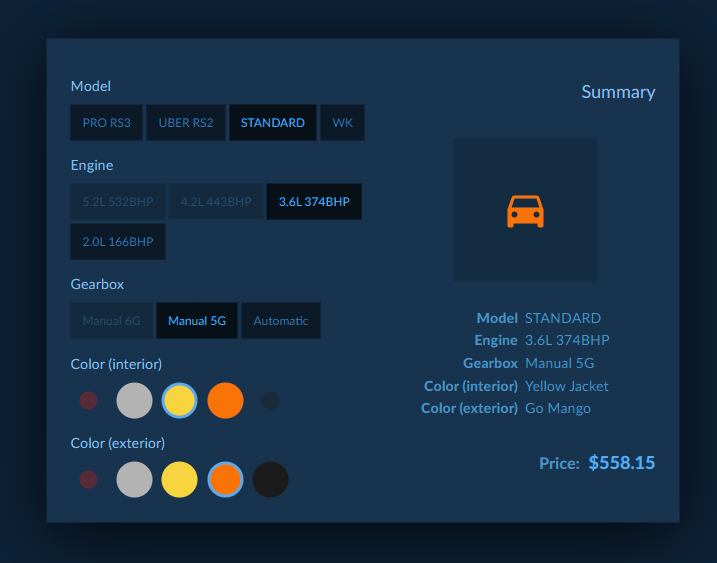

# Car customization

- [Usage](#Usage)
- [Project requirements](#project-requirements)
- [How it's made](#how-its-made)
  - [Front- and backend](#front--and-backend)
  - [Layout creation](#layout-creation)
  - [Part compatibility](#part-compatibility)
  - [Price calculation](#price-calculation)
  - [Possibilities](#possibilities)
- [Author and license](#author-and-license)

## Usage

To start project simply clone it on your disc:
`git clone https://github.com/Shlizer/car_customization.git`

Then go to project directory and install all dependencies using npm or yarn:
`npm instal`
`yarn`

At last to start project simply use
`npm run start` or
`yarn start`

It's possible also to run both frontend and backend parts separately using prefixes like so:
`npm run start:frontend` or `npm run start:backend`
`yarn start:frontend` or `yarn start:backend`

Important thing is to have port 4000 opened for backend app.

## Project requirements

- [x] Project should use React and Redux
- [x] Data should be provided asynchronously from external source
- [x] Dynamic layout from given data
- [x] Fetching car list and car parts
- [x] Each car can have different compatibility with other parts
- [x] Each gearbox have different compatibility with gearboxes
- [x] Calculating price for all selected parts and presenting summary

## How it's made

### Front- and backend

Project is divided into two separate elements, that can be even further split into two repositories and developed separately. First one - backend, is just regular Express server that provides all needed data from our fixed database. Second, frontend that is, fulfill the representation of data. It's made of React+Redux with HMR.

### Layout creation

Page layout is created from provided DB data. I'm using simple component manager to load proper react components where given scheme puts them. There is even possibility to add own attributes to those elements such as style, className and so on.

### Part compatibility

Each parts (and I'm counting car model as parts too) has it's own 'noFit' array of elements that can reduce visible parts in the output screen and prevent selecting them alongside with this part.

### Price calculation

Every part has it's own prop called 'price'. After selecting each element I'm just summing up all selected parts, so user can see final result. I also provided on hover all part costs individually.

### Possibilities

This project have some easy to upgrade parts such as all layout colors are stored in css variables so making basic color theming is easy. Also it's possible to add new part types - just add new entry in `backend/src/db/parts.js` and equivalent file with types in `backend/src/db/parts/*`.

## Author and license

Author: Krzysztof 'Shlizer' Hinc
License: MIT
